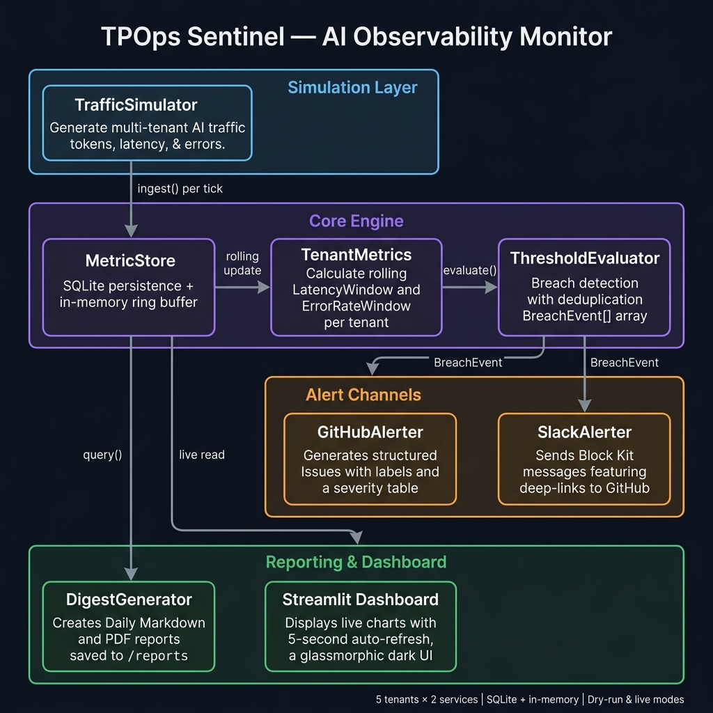
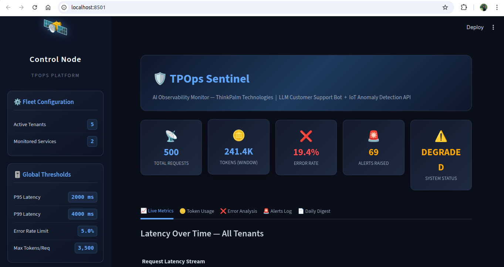
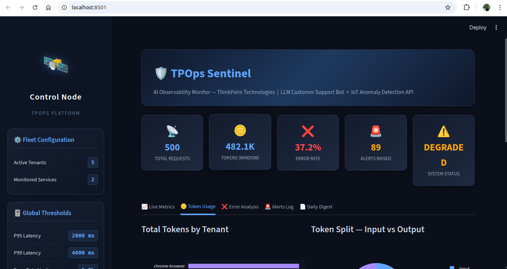
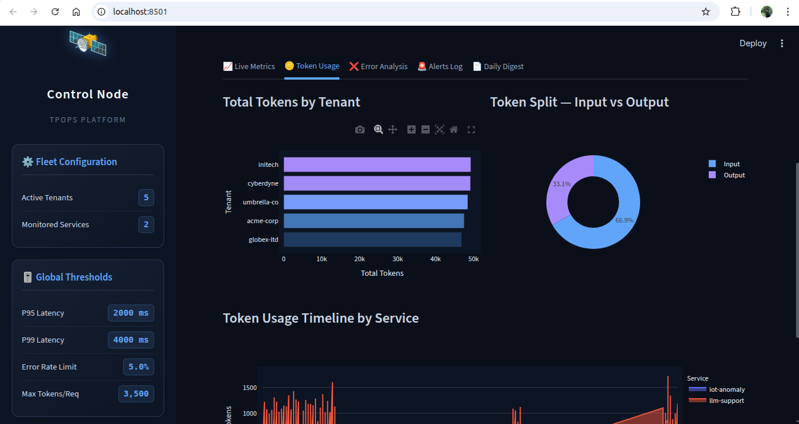
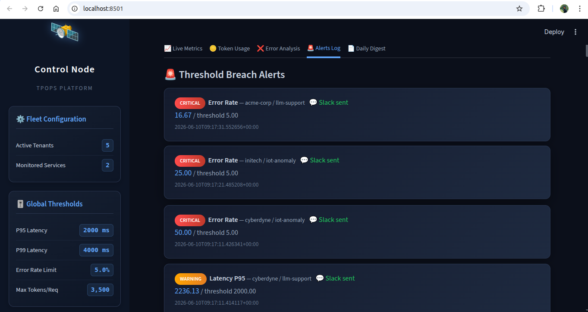
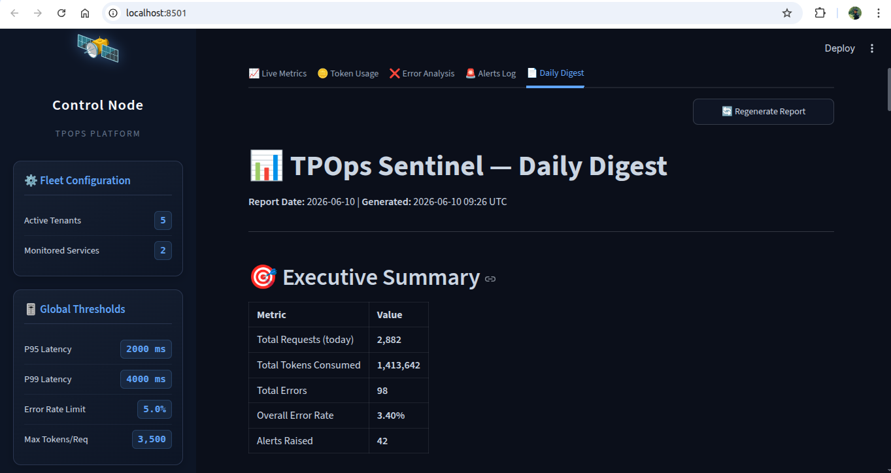

# 🛡️ TPOps Sentinel — AI Observability Monitor

> **Production-grade observability platform** for ThinkPalm AI-powered services.
> Tracks token usage, latency percentiles, error rates per tenant — and auto-raises
> GitHub Issues + Slack alerts the moment thresholds breach.

[](https://python.org)
[](https://streamlit.io)
[](LICENSE)

---

## 📌 Problem Statement

Modern AI-powered products — LLM chatbots, IoT inference APIs, recommendation engines — expose a critical operational blind spot: **once deployed, their runtime behaviour is essentially invisible.**

Teams have no real-time visibility into:
- How many tokens each tenant is consuming per minute (leading to surprise API bills)
- Whether inference latency is silently degrading past SLA thresholds (P95/P99)
- Which tenants are generating error spikes, and why

**TPOps Sentinel solves this** by acting as an always-on, multi-tenant AI observability layer. It continuously ingests telemetry from AI services, evaluates live metrics against configurable SLA thresholds, and automatically raises structured GitHub Issues and Slack alerts — reducing mean-time-to-detect (MTTD) from hours to seconds.

---

## 👥 Team Members & Contributions

| Member | Role | Contributions |
|--------|------|--------------|
| **ThinkPalm AI Engineering Team** | Platform Lead | End-to-end system design, `sentinel/` core engine, SQLite store, rolling-window percentile calculator |
| *(Add your name here)* | Dashboard & Reporting | Streamlit dashboard, DigestGenerator (Markdown + PDF), Plotly charts |
| *(Add your name here)* | Alerting & Integration | GitHubAlerter (PyGithub), SlackAlerter (Block Kit), threshold deduplication logic |
| *(Add your name here)* | QA & DevOps | Pytest test suite, `.env` configuration layer, `config.yaml` schema design |

> **Note:** Update names and split contributions to match your actual team before submission.

---

## 🏗️ Architecture



> 📄 Full 1-page write-up: [`docs/architecture_writeup.md`](docs/architecture_writeup.md)

### Data Flow

```
┌──────────────────────────────────────────────────────────────────────┐
│                         SIMULATION LAYER                             │
│   TrafficSimulator ──► MetricBatch (tokens + latency + errors)       │
└────────────────────────────────┬─────────────────────────────────────┘
                                 │ ingest() — every 5 s tick
                                 ▼
┌──────────────────────────────────────────────────────────────────────┐
│                           CORE ENGINE                                │
│  ┌─────────────────┐    ┌──────────────────┐    ┌────────────────┐  │
│  │   MetricStore   │───►│  TenantMetrics   │───►│  Threshold     │  │
│  │ SQLite + ring   │    │  LatencyWindow   │    │  Evaluator     │  │
│  │ buffer (dual    │    │  ErrorRateWindow │    │  BreachEvent[] │  │
│  │ write)          │    │  (rolling, 60 s) │    │  + cooldown    │  │
│  └─────────────────┘    └──────────────────┘    └───────┬────────┘  │
└────────────────────────────────────────────────────────┼────────────┘
                            breach detected              │
                    ┌────────────────────────────────────┤
                    ▼                                    ▼
         ┌──────────────────┐                ┌───────────────────────┐
         │  GitHubAlerter   │                │     SlackAlerter      │
         │  Structured      │◄── issue URL ──│  Block Kit message    │
         │  Issue + labels  │                │  + GitHub deep-link   │
         └──────────────────┘                └───────────────────────┘
                    │ query()                        live read
                    ▼                                    ▼
┌──────────────────────────────────────────────────────────────────────┐
│                      REPORTING & DASHBOARD                           │
│  ┌──────────────────────────┐    ┌────────────────────────────────┐  │
│  │    DigestGenerator       │    │     Streamlit Dashboard        │  │
│  │  Markdown + PDF reports  │    │  Live charts, 5 s auto-refresh │  │
│  │  → ./reports/            │    │  http://localhost:8501          │  │
│  └──────────────────────────┘    └────────────────────────────────┘  │
└──────────────────────────────────────────────────────────────────────┘
```

### Layer Summary

| Layer | Components | Responsibility |
|-------|-----------|---------------|
| **Simulation** | `TrafficSimulator` | Generates realistic multi-tenant AI telemetry with anomaly injection |
| **Core Engine** | `MetricStore` · `TenantMetrics` · `ThresholdEvaluator` | Dual-write storage, rolling-window percentiles, breach detection |
| **Alert Channels** | `GitHubAlerter` · `SlackAlerter` | Structured Issues + Block Kit messages on every breach |
| **Reporting** | `DigestGenerator` · Streamlit Dashboard | Daily PDF/Markdown digest + live 5 s-refresh dashboard |

---

## 🎯 Services & Tenants Monitored

| Service | Model | Description |
|---------|-------|-------------|
| **LLM Customer Support Bot** | `gpt-4o` | High-volume conversational AI with variable token usage |
| **IoT Anomaly Detection API** | `custom-anomaly-v2` | Low-latency batch inference for sensor anomalies |

| Tenant | Tier | Token Quota |
|--------|------|-------------|
| `acme-corp` | Enterprise | 500,000/day |
| `globex-ltd` | Enterprise | 400,000/day |
| `initech` | Standard | 200,000/day |
| `umbrella-co` | Standard | 150,000/day |
| `cyberdyne` | Starter | 100,000/day |

---

## 📊 Metrics & Thresholds

| Metric | Description | Warning | Critical |
|--------|-------------|---------|----------|
| **P50 / P95 / P99 Latency** | Rolling percentiles per tenant/service | P95 > 2,000 ms ⚠️ | P99 > 4,000 ms 🔴 |
| **Error Rate %** | Errors / total requests in 60 s window | > 5% ⚠️ | > 10% 🔴 |
| **Tokens / Request** | Per-request token consumption | > 3,500 ⚠️ | — |
| **Total Token Usage** | Cumulative per tenant | Dashboard + digest | — |

---

## 🛠 Tech Stack with Versions

| Component | Technology | Version |
|-----------|-----------|---------|
| **Language** | Python | `3.11+` |
| **Dashboard** | Streamlit | `≥ 1.35.0` |
| **Dashboard auto-refresh** | streamlit-autorefresh | `≥ 1.0.1` |
| **Charts** | Plotly | `≥ 5.22.0` |
| **Metrics / Analytics** | NumPy | `≥ 1.26.0` |
| **Data Handling** | Pandas | `≥ 2.2.0` |
| **Storage** | SQLite | stdlib (Python 3.11) |
| **GitHub Alerting** | PyGithub | `≥ 2.3.0` |
| **Slack Alerting** | slack_sdk | `≥ 3.27.0` |
| **PDF Reports** | reportlab | `≥ 4.2.0` |
| **Scheduling** | schedule | `≥ 1.2.1` |
| **Config** | PyYAML | `≥ 6.0.1` |
| **Env Management** | python-dotenv | `≥ 1.0.1` |
| **Testing** | pytest + pytest-mock | `≥ 8.2.0 / ≥ 3.14.0` |

All pinned versions are in [`requirements.txt`](requirements.txt).

---

## 🚀 How to Run Locally — Step by Step

### Prerequisites
- Python **3.11 or higher** (`python3 --version`)
- `pip` and `venv` available
- Git installed

---

### Step 1 — Clone the repository

```bash
git clone https://github.com/your-org/tpops-sentinal.git
cd tpops-sentinal
```

### Step 2 — Create & activate a virtual environment

```bash
python3 -m venv venv
source venv/bin/activate        # macOS / Linux
# venv\Scripts\activate.bat    # Windows
```

### Step 3 — Install all dependencies

```bash
pip install -r requirements.txt
```

### Step 4 — Configure credentials (optional for dry-run)

```bash
cp .env.example .env
```

Open `.env` and fill in your credentials:

```env
GITHUB_TOKEN=ghp_xxxxxxxxxxxx
GITHUB_REPO=your-org/tpops-sentinal
SLACK_WEBHOOK_URL=https://hooks.slack.com/services/xxx/yyy/zzz
```

> **Skip this step** if you only want to run in `--dry-run` mode (recommended for first-time setup).

### Step 5 — Run the AI traffic monitor

```bash
# Safe dry-run: prints GitHub/Slack payloads to console, no real API calls
python3 src/run_monitor.py --dry-run

# Smoke test — runs for 60 seconds then exits cleanly
python3 src/run_monitor.py --dry-run --duration 60

# Live mode — requires valid credentials in .env
python3 src/run_monitor.py
```

You will see a live ASCII table updating every 5 seconds:

```
  Tick    1 │ Reqs:   45 │ Tokens:  87,320 │ Errors:   4 (  8.9%) │ Alerts:   1   ⚠️  1 BREACH(ES)!
  Tick    2 │ Reqs:   52 │ Tokens:  94,110 │ Errors:   2 (  3.8%) │ Alerts:   1
  ...
```

### Step 6 — Launch the Streamlit Dashboard

Open a **new terminal tab**, activate the venv, then run:

```bash
source venv/bin/activate
python3 -m streamlit run src/dashboard.py
```

Your browser will open automatically at **http://localhost:8501**

Dashboard panels:
- 📈 **Live Metrics** — system health, latency heat-maps (auto-refreshes every 5 s)
- 🪙 **Token Usage** — per-tenant consumption rankings
- ❌ **Error Analysis** — breakdown by error category
- 🔔 **Alerts Log** — full ledger of every SLA breach

### Step 7 — Generate a Daily Digest Report

```bash
python3 src/run_monitor.py --digest-now
# Output → ./reports/digest_YYYY-MM-DD.md  +  .pdf
```

### Step 8 — Run the test suite

```bash
pytest tests/ -v
```

Expected output:
```
tests/test_metrics.py    ........   PASSED
tests/test_evaluator.py  ........   PASSED
tests/test_alerters.py   ........   PASSED
```

---

## 🖼️ Screenshots

### CLI Monitor — Live Traffic Table


### Streamlit Dashboard — Live Metrics Panel


### Streamlit Dashboard — Token Usage & Error Analysis


### Automated Alert — GitHub Issue Auto-Raised


### Automated Alert — Slack Block Kit Message


### Daily Digest Report (PDF)


> 📸 **To add screenshots:** Run the platform locally (`--dry-run`), take screenshots, and save them as `docs/screenshots/<name>.png`.

---

## 🎥 Demo Video

> 📹 **5-Minute Walkthrough:** [Watch on Loom / YouTube](#)
>
> *(Replace `#` above with your Loom or YouTube link before submission)*

The demo covers:
1. Starting the monitor in `--dry-run` mode and observing live traffic simulation
2. A threshold breach being detected and an alert payload being generated
3. Launching the Streamlit dashboard and touring all four panels
4. Generating the daily PDF digest report

---

## 🎬 Demo Walkthrough Script

Use this as a step-by-step script for a live presentation:

### Step 1: Start the Monitor
Open Terminal 1 and run the simulator:
```bash
source venv/bin/activate
python3 src/run_monitor.py --dry-run
```
*Point out the live tick table — token counts and error rates updating every 5 s.*

### Step 2: Observe a Breach Alert
Within ~30 seconds, the `TrafficSimulator` injects an anomaly. You will see:
```
  ⚠️  1 BREACH(ES)!
  [DRY-RUN] GitHub Issue payload: 🔴 [CRITICAL] Latency P99 breach — tenant: acme-corp
  [DRY-RUN] Slack Block Kit payload sent to #ai-ops-alerts
```

### Step 3: Launch the Dashboard
Open Terminal 2:
```bash
source venv/bin/activate
python3 -m streamlit run src/dashboard.py
```
*Browser opens at http://localhost:8501 — tour each panel.*

### Step 4: Generate the Digest
Stop the monitor (`Ctrl+C`), then:
```bash
python3 src/run_monitor.py --digest-now
```
*Open `reports/digest_YYYY-MM-DD.pdf` — show the executive summary and SLA compliance table.*

---

## 🔔 Alert Channels

### GitHub Issues (Auto-Raised)

```
🔴 [CRITICAL] Latency P99 breach — tenant: acme-corp | service: llm-support

Severity: CRITICAL
Tenant: acme-corp | Service: llm-support
Metric: P99 Latency → 5,234 ms  (threshold: 4,000 ms)

Recommended Actions:
1. Check model inference cluster health
2. Review recent deployments for regressions
3. Consider scaling out inference workers
```

Labels applied: `auto-raised`, `severity:critical`, `service:llm-support`, `tenant:acme-corp`

### Slack Block Kit Alert

Color-coded message with:
- Severity badge + metric table
- GitHub Issue deep-link button
- Timestamp + channel routing

---

## ⚙️ Configuration

All thresholds, tenants, and services are defined in `src/config.yaml`:

```yaml
thresholds:
  latency_p95_ms: 2000
  latency_p99_ms: 4000
  error_rate_pct: 5.0
  tokens_per_request: 3500

monitor:
  tick_interval_seconds: 5
  dry_run: false
```

Override `dry_run` via environment: `SENTINEL_DRY_RUN=true`

---

## 📄 Daily Digest

Auto-generated at 08:00 UTC (configurable). Includes:

- **Executive Summary** — total requests, tokens, error rate, alerts raised
- **Per-Tenant Token Table** — consumption by tenant and service
- **Latency Statistics** — avg, min, max per tenant/service
- **Error Breakdown** — by category and tenant
- **SLA Compliance** — P95/P99/error-rate pass/fail table
- **Alerts Log** — all breaches with GitHub issue links

Output formats: **Markdown** + **PDF** (via reportlab)

---

## 📁 Project Structure

```
tpops-sentinal/
├── src/                          # All application source code
│   ├── sentinel/                 # Core observability engine (Python package)
│   │   ├── __init__.py
│   │   ├── simulator.py          # Multi-tenant AI traffic generator
│   │   ├── metrics.py            # Dataclasses + rolling-window calculators
│   │   ├── store.py              # SQLite + in-memory ring buffer
│   │   ├── evaluator.py          # Threshold breach detection + deduplication
│   │   ├── github_alerter.py     # Auto GitHub Issue creator (PyGithub)
│   │   ├── slack_alerter.py      # Block Kit Slack alerter
│   │   ├── digest.py             # Daily Markdown + PDF report generator
│   │   └── utils.py              # Config, logging, helpers
│   ├── dashboard.py              # Streamlit live dashboard
│   ├── run_monitor.py            # CLI orchestrator / entrypoint
│   └── config.yaml               # Thresholds, tenants, services
├── docs/
│   ├── architecture.png          # System architecture diagram (PNG)
│   ├── architecture_writeup.md   # 1-page architecture write-up
│   └── screenshots/              # UI screenshots for README
├── tests/                        # Pytest unit test suite
│   ├── __init__.py
│   ├── test_metrics.py           # LatencyWindow / ErrorRateWindow tests
│   ├── test_evaluator.py         # ThresholdEvaluator breach logic tests
│   └── test_alerters.py          # GitHubAlerter / SlackAlerter dry-run tests
├── reports/                      # Auto-generated daily digest reports
├── .env.example                  # Credential template (copy → .env)
├── .gitignore
├── requirements.txt              # Pinned Python dependencies
└── README.md
```

---

## 📜 License

MIT © ThinkPalm Technologies
